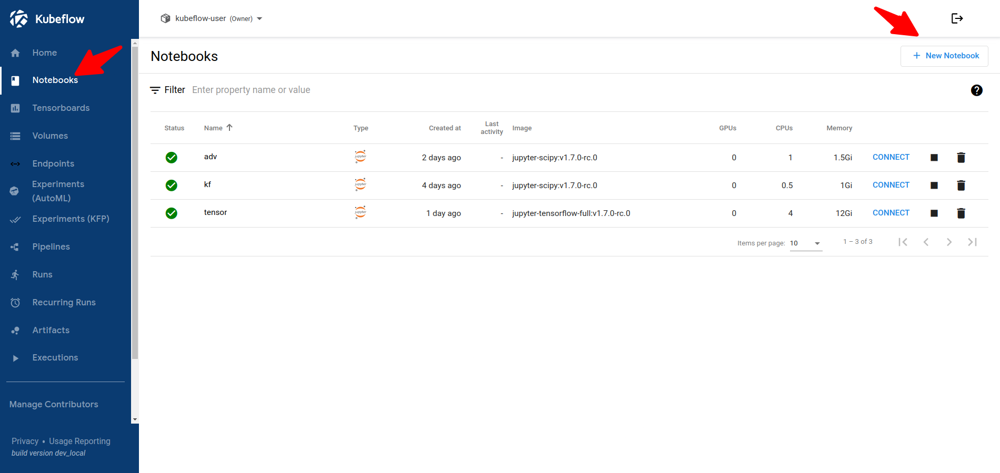
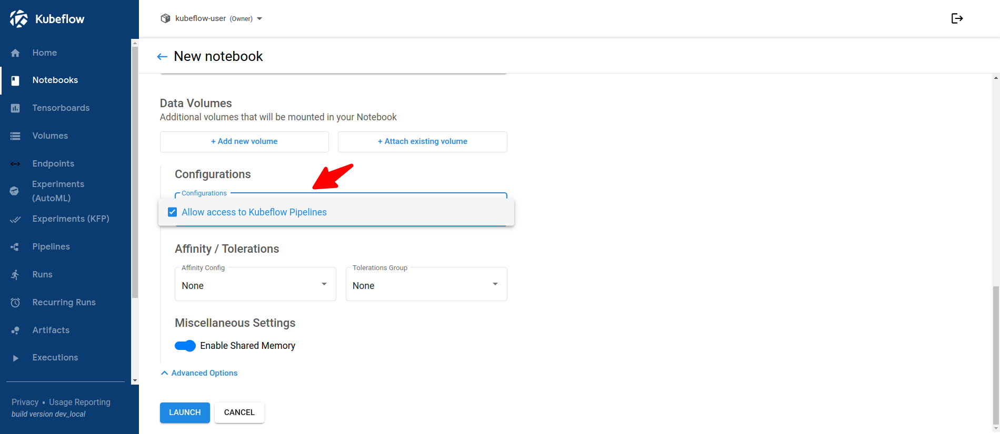
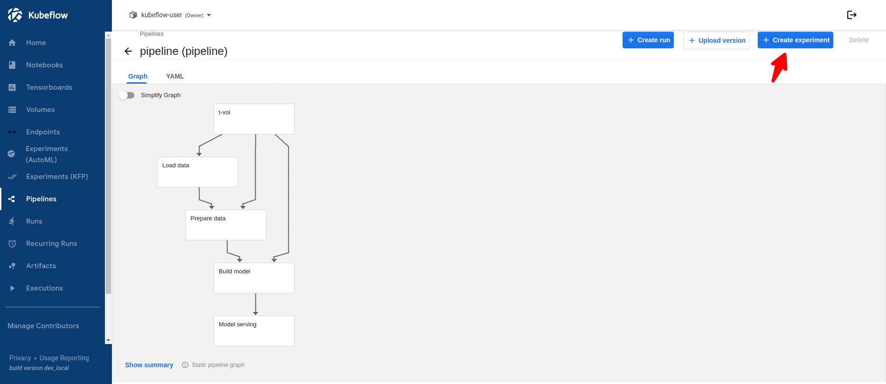
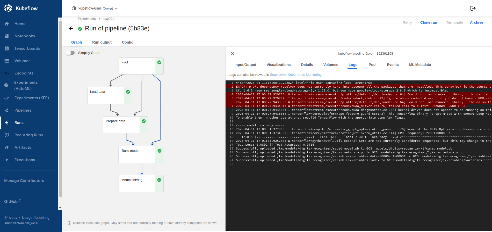
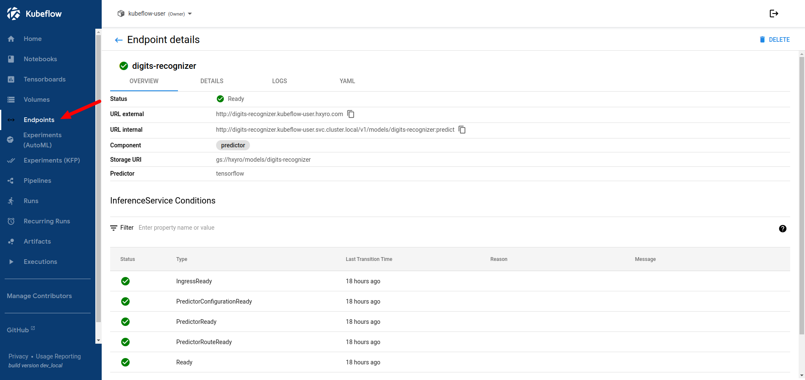
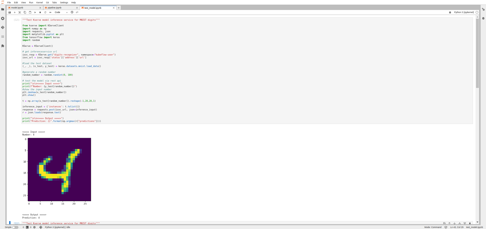
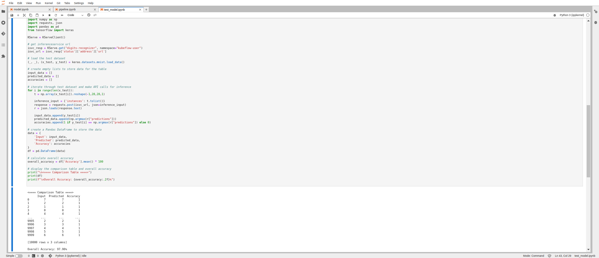

### Installation of Kubeflow

To install Kubeflow, please follow these steps:

- Visit the [kubeflow/manifests](https://github.com/kubeflow/manifests) repository and Install Kubeflow using the provided manifests.

- After installation, configure Kubeflow by following the instructions below:

#### Resetting Passwords

Open the `kubeflow/dex-config.yaml` file and make the following edits:

```
...
staticPasswords:
    - email: <your email>
      hash: <password hash>
...
```

Then apply the changes using the following command:

```
kubectl apply -f kubeflow/dex-config.yaml
```

To generate a password hash, you can use the following Python script:

```
python3 -c 'from passlib.hash import bcrypt; import getpass; print(bcrypt.using(rounds=12, ident="2y").hash(getpass.getpass()))'
```

### Creating a New Profile

Open the `kubeflow/profile.yaml` file and configure a new profile by providing a name and owner's email (same as in `kubeflow/dex-config.yaml`):

```
apiVersion: kubeflow.org/v1
kind: Profile
metadata:
  name: <name>
spec:
  owner:
    kind: User
    name: <email same as kubeflow/dex-config.yaml>
```

Apply the changes using the following command:

```
kubectl apply -f kubeflow/profile.yaml
```

### Patching Istio Ingressgateway

Patch the Istio Ingressgateway service to use LoadBalancer type:

```
kubectl patch svc istio-ingressgateway -n istio-system -p '{"spec":{"type":"LoadBalancer"}}'
```

### Granting Access to Kubeflow Pipelines

Open the `kubeflow/access.yaml` file and grant access to Kubeflow pipelines by specifying the namespace (same as your profile name) in the metadata section:

```
apiVersion: kubeflow.org/v1alpha1
kind: PodDefault
metadata:
  name: access-ml-pipeline
  namespace: <same as your profile name>
....
```

Apply the changes using the following command:

```
kubectl apply -f kubeflow/access.yaml
```

### Setting up Notebook Server

To begin with, follow the steps below to set up your notebook server:

- Create a new notebook in your desired environment.
  

- Make sure to click on the 'Allow access to Kubeflow Pipelines' option.
  

- Connect to the notebook server and upload all the notebooks from the project directory.

### Running the Project

Please follow these steps to run the project:

**NOTE:** You may need to install additional dependencies like TensorFlow for the project to work properly.

- #### Train and Run the Model

  Open the `project/model.ipynb` notebook and run it. This will build the model and save it to the filesystem.

- #### Build the Pipeline

  **NOTE:** The storage options may need to be configured separately since I am using GCS instead of MinIO

  Open the `project/pipeline.ipynb` notebook and run it. After a successful run, you will find a pipeline.yaml file in the same directory. Download this file and proceed to the next steps.

- #### Run the Pipeline

  Upload the pipeline using the Kubeflow dashboard. Create an experiment and run the pipeline as shown in the screenshots below:

  

  After a successful run, you will have model endpoints available in the Endpoints section as shown in the screenshots below:

  
  

- #### Test the Model
  You can now test the model using the `project/test_model.ipynb` notebook.
  
  
